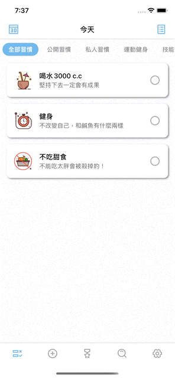
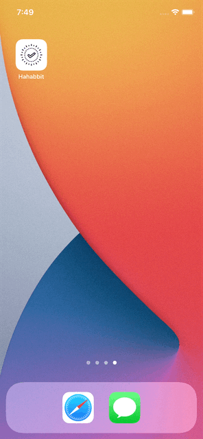
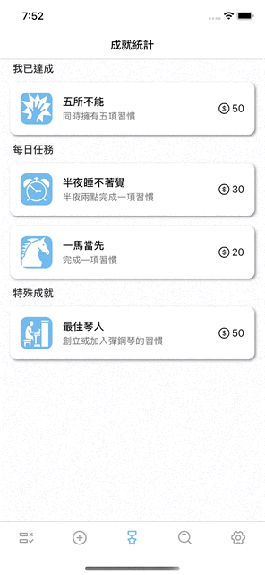
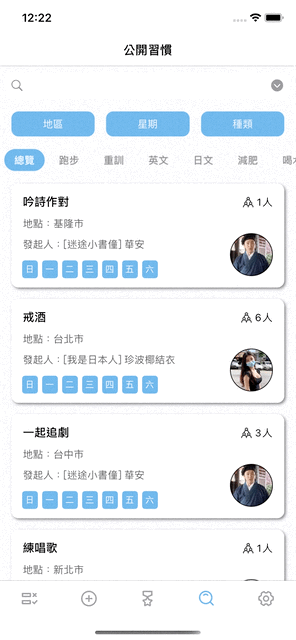
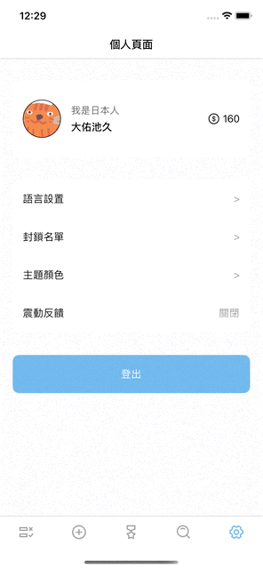

# Hahabbit

> Best way to develop good habits!  

Hahabbit 是一個幫助您培養習慣與記錄每日習慣執行狀況的好幫手，也可以透過此 App 認識其他想培養相同習慣的使用者或是與其他使用者們分享培養習慣的心得。

## Features & ScreenShots
- 記錄每日習慣執行狀況，自動產生圖表輔助你了解習慣的執行狀況 
    
    
- 新增習慣並設定提醒時間，讓 App 於你指定的時間發出通知提醒你該完成習慣  
    　
    
- 遊戲化的成就系統，增加使用者完成習慣的動力  
    
    
- 搜尋其他使用者的公開習慣，加入一起執行  
    
    
- 可於公開習慣內的多人聊天室一同分享習慣的執行心得，進而認識更多想培養相同習慣的其他使用者  
    
    
- 可在 App 內自由設定語言、主題色彩等等  
    　

## Libraries  
- [Firebase](https://github.com/firebase/firebase-ios-sdk)
   - Auth - 驗證用戶註冊與登入資訊，提供登入與登出功能
   - Storage - 儲存用戶上傳的個人照片與習慣照片
   - Firestore - 儲存與管理所有用戶個人資料、習慣細節與聊天對話紀錄等資料
   - Crashlytics - 掌握 App 的 Crash 報告，以供 bug 修復與效能改善
- [Kingfisher](https://github.com/onevcat/Kingfisher) - 善用快取的方式處理網路圖片並呈現在 App
- [FSCalendar](https://github.com/WenchaoD/FSCalendar) - 客製化月曆外觀，並以月曆呈現每日不同的習慣列表
- [SwiftLint](https://github.com/realm/SwiftLint) - 檢查 codeing Style 增進程式碼品質
- [IQKeyboardManager](https://github.com/hackiftekhar/IQKeyboardManager) - 解決鍵盤彈起時遮住輸入框或畫面內容的問題
- [ScrollableGraphView](https://github.com/philackm/ScrollableGraphView) - 呈現曲線趨勢圖表
- [MBCircularProgressBar](https://github.com/MatiBot/MBCircularProgressBar)- 呈現圓餅圖表
- [Lottie-ios](https://github.com/airbnb/lottie-ios) - 呈現動畫效果
- [MJRefresh](https://github.com/CoderMJLee/MJRefresh) - 提供下拉更新功能
- [JGProgressHUD](https://github.com/JonasGessner/JGProgressHUD) - 顯示上傳完成等各種狀態的提示窗
- [SwiftTheme](https://github.com/wxxsw/SwiftTheme) - 提供直接在 App 內轉換主題顏色的功能
- [Localize-Swift](https://github.com/marmelroy/Localize-Swift) - 提供直接在 App 內轉換介面語言的功能  

## Requirements

- iOS 13.4 or later
- Xcode 12 or later

## Version History
- 1.0.4 - 2021/06/27 - 抓了幾隻臭蟲
- 1.0.3 - 2021/06/22 - 優化某些 UI 顯示方式，抓了幾隻臭蟲
- 1.0.2 - 2021/06/16 - 新增更換主題顏色功能
- 1.0.1 - 2021/06/14 - 新增語言切換功能  
- 1.0.0 - 2021/06/12 - 第一個上架版本
 
## Contacts

Max Tsai  
Email: pisck780527@gmail.com